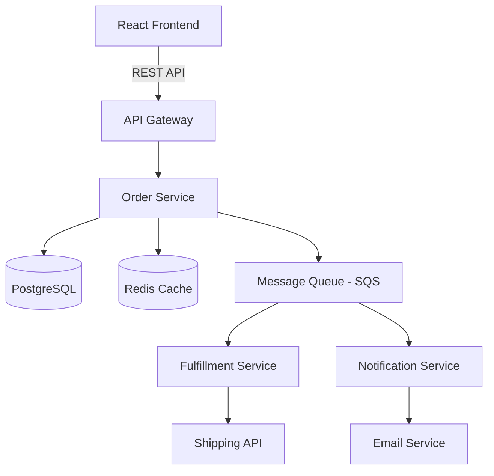

# Kiro and Spec-Driven Development

Transform "vibe coding" into viable, maintainable code with specification-first development.

## Table of Contents
1. [What is Spec-Driven Development?](#what-is-spec-driven-development)
2. [Kiro Overview](#kiro-overview)
3. [Setup & Installation](#setup--installation)
4. [Workflow](#workflow)
5. [Templates & Examples](#templates--examples)
6. [Best Practices](#best-practices)
7. [Integration with Amazon Q](#integration-with-amazon-q)
8. [When to Use (and Not Use)](#when-to-use-and-not-use)

---

## What is Spec-Driven Development?

### The Problem: Vibe Coding Chaos

**Vibe coding** = Prompt AI → Get code → Ship it

**Challenges**:
- Undocumented or loosely structured code
- Difficult to maintain after 3-6 months
- Regression bugs when adding features
- Hard to onboard new developers
- No clear source of truth

**Example**:
```
You: "Build a user authentication system"
AI: [Generates 500 lines of code]
You: "Great, ship it!"

[3 months later]
New dev: "How does password reset work?"
You: "Uh... let me read the code..."
```

### The Solution: Spec-Driven Development

**Spec-driven** = Write spec → Generate plan → Implement → Docs stay in sync

**Specifications as executable artifacts**:
- Requirements with acceptance criteria
- Technical design with architecture
- Implementation tasks with traceability
- Changes to specs → automatic task updates

**Benefits**:
- Source of truth for what and why
- Self-documenting codebase
- Easier code reviews (compare to spec)
- Onboarding: read spec, understand system
- Maintainability: update spec, regen tasks

---

## Kiro Overview

### What is Kiro?

- **VS Code fork** powered by Claude (Anthropic)
- **Launched**: July 2025 (currently in preview)
- **Philosophy**: "Vibe coding to viable code"
- **Pricing**: $20/month
- **Platform**: Mac, Windows, Linux

### Three-Document Workflow

Kiro structures development around three markdown files:

1. **requirements.md**: What to build (user stories + acceptance criteria)
2. **design.md**: How to build it (architecture + components + data models)
3. **tasks.md**: Step-by-step implementation checklist

### Key Features

**Bidirectional Sync**:
- Update code → Specs refresh automatically
- Update specs → Tasks regenerate

**Automatic Generation**:
- AI generates requirements from natural language
- Creates architecture diagrams, API specs, database schemas
- Breaks design into actionable tasks

**Traceability**:
- Every task links to requirements
- Design decisions documented
- Changes tracked with rationale

**Languages Supported**:
Python, Java, JavaScript, TypeScript, C#, Go, Rust, PHP, Ruby, Kotlin, C, C++, shell, SQL, Scala, JSON, YAML, HCL

---

## Setup & Installation

### Install Kiro

**Download**: https://kiro.dev/

**Mac**:
```bash
brew install --cask kiro
```

**Windows/Linux**:
Download installer from website

### Initial Configuration

1. **Open Kiro** (VS Code fork interface)
2. **Sign in** with account
3. **Set preferences**:
   - Default spec template
   - Auto-sync settings
   - Claude model selection

### Project Structure

Kiro creates this structure:
```
your-project/
├── .kiro/
│   ├── requirements.md    # User stories
│   ├── design.md          # Technical design
│   ├── tasks.md           # Implementation tasks
│   └── config.yml         # Kiro settings
├── src/                   # Your code
└── tests/                 # Your tests
```

---

## Workflow

### Phase 1: Requirements Definition

**Input**: Natural language description of feature

**Example**:
```
In Kiro chat:
"Build an order management system for an e-commerce platform.
Users should be able to create orders, view order history, track shipments,
and process returns. Include admin capabilities for managing orders."
```

**Kiro generates** `.kiro/requirements.md`:
```markdown
# Requirements: Order Management System

## User Story 1: Create Order
**As a** customer
**I want to** create an order with items from my cart
**So that** I can purchase products

**Acceptance Criteria**:
- [ ] User can add items to cart
- [ ] User can review cart before checkout
- [ ] System validates product availability
- [ ] System calculates total with tax and shipping
- [ ] User provides shipping and billing information
- [ ] Order confirmation email sent
- [ ] Inventory updated after successful order

## User Story 2: View Order History
**As a** customer
**I want to** view my past orders
**So that** I can track purchases and reorder items

**Acceptance Criteria**:
- [ ] User can see list of all orders
- [ ] Orders sorted by date (newest first)
- [ ] Each order shows: order number, date, items, total, status
- [ ] User can filter by order status
- [ ] User can search by order number or product name

## User Story 3: Track Shipment
**As a** customer
**I want to** track my order shipment
**So that** I know when to expect delivery

**Acceptance Criteria**:
- [ ] User can view shipment status
- [ ] Integration with carrier APIs for real-time tracking
- [ ] Email notifications for shipment updates
- [ ] Estimated delivery date shown

## User Story 4: Process Returns
**As a** customer
**I want to** return unwanted items
**So that** I can get a refund

**Acceptance Criteria**:
- [ ] User can initiate return within 30 days
- [ ] User provides return reason
- [ ] System generates return shipping label
- [ ] Admin approves/rejects return
- [ ] Refund processed after item received
- [ ] Inventory updated

## User Story 5: Admin Order Management
**As an** admin
**I want to** manage all customer orders
**So that** I can handle issues and track business metrics

**Acceptance Criteria**:
- [ ] Admin can view all orders
- [ ] Admin can filter/search orders
- [ ] Admin can update order status
- [ ] Admin can process refunds
- [ ] Admin can view order analytics
```

**Review and edit**: Refine requirements with stakeholders

### Phase 2: Technical Design

**Input**: Approved requirements + existing codebase analysis

**Kiro generates** `.kiro/design.md`:
```markdown
# Technical Design: Order Management System

## Architecture Overview



## Tech Stack
- **Backend**: Python 3.11 + FastAPI
- **Database**: PostgreSQL 14
- **Cache**: Redis 7
- **Message Queue**: AWS SQS
- **Frontend**: React 18 + TypeScript
- **Deployment**: ECS Fargate
- **Monitoring**: CloudWatch + X-Ray

## Database Schema

### Orders Table
```sql
CREATE TABLE orders (
    id UUID PRIMARY KEY DEFAULT gen_random_uuid(),
    user_id UUID NOT NULL REFERENCES users(id),
    order_number VARCHAR(20) UNIQUE NOT NULL,
    status VARCHAR(20) NOT NULL CHECK (status IN ('pending', 'confirmed', 'shipped', 'delivered', 'cancelled', 'returned')),
    subtotal DECIMAL(10,2) NOT NULL,
    tax DECIMAL(10,2) NOT NULL,
    shipping_cost DECIMAL(10,2) NOT NULL,
    total DECIMAL(10,2) NOT NULL,
    shipping_address JSONB NOT NULL,
    billing_address JSONB NOT NULL,
    created_at TIMESTAMP DEFAULT NOW(),
    updated_at TIMESTAMP DEFAULT NOW()
);

CREATE INDEX idx_orders_user_id ON orders(user_id);
CREATE INDEX idx_orders_status ON orders(status);
CREATE INDEX idx_orders_created_at ON orders(created_at DESC);
```

### Order Items Table
```sql
CREATE TABLE order_items (
    id UUID PRIMARY KEY DEFAULT gen_random_uuid(),
    order_id UUID NOT NULL REFERENCES orders(id) ON DELETE CASCADE,
    product_id UUID NOT NULL REFERENCES products(id),
    quantity INTEGER NOT NULL CHECK (quantity > 0),
    unit_price DECIMAL(10,2) NOT NULL,
    total_price DECIMAL(10,2) NOT NULL,
    created_at TIMESTAMP DEFAULT NOW()
);

CREATE INDEX idx_order_items_order_id ON order_items(order_id);
```

### Returns Table
```sql
CREATE TABLE returns (
    id UUID PRIMARY KEY DEFAULT gen_random_uuid(),
    order_id UUID NOT NULL REFERENCES orders(id),
    order_item_id UUID NOT NULL REFERENCES order_items(id),
    reason TEXT NOT NULL,
    status VARCHAR(20) NOT NULL CHECK (status IN ('requested', 'approved', 'rejected', 'received', 'refunded')),
    refund_amount DECIMAL(10,2),
    tracking_number VARCHAR(50),
    created_at TIMESTAMP DEFAULT NOW(),
    updated_at TIMESTAMP DEFAULT NOW()
);
```

## API Endpoints

### Order Management
- `POST /api/v1/orders` - Create new order
- `GET /api/v1/orders` - List user's orders (paginated)
- `GET /api/v1/orders/{id}` - Get order details
- `PATCH /api/v1/orders/{id}` - Update order (admin only)
- `DELETE /api/v1/orders/{id}` - Cancel order

### Returns
- `POST /api/v1/orders/{id}/returns` - Initiate return
- `GET /api/v1/returns/{id}` - Get return status
- `PATCH /api/v1/returns/{id}` - Update return status (admin)

### Tracking
- `GET /api/v1/orders/{id}/tracking` - Get shipment tracking info

## Service Layer Components

### OrderService
**Responsibilities**:
- Create orders with validation
- Calculate totals (subtotal + tax + shipping)
- Validate product availability
- Coordinate with payment service
- Emit order events to queue

**Methods**:
```python
class OrderService:
    async def create_order(self, user_id: UUID, cart_items: List[CartItem], addresses: AddressInfo) -> Order
    async def get_order(self, order_id: UUID, user_id: UUID) -> Order
    async def list_orders(self, user_id: UUID, filters: OrderFilters, pagination: Pagination) -> List[Order]
    async def update_order_status(self, order_id: UUID, new_status: OrderStatus, admin_id: UUID) -> Order
    async def cancel_order(self, order_id: UUID, user_id: UUID) -> Order
```

### ReturnService
**Responsibilities**:
- Initiate returns with validation
- Generate return shipping labels
- Process refunds
- Update inventory

### TrackingService
**Responsibilities**:
- Integrate with carrier APIs (UPS, FedEx, USPS)
- Cache tracking info in Redis
- Emit tracking events

## Data Flow

### Create Order Flow
1. User submits order via API
2. OrderService validates cart items, checks inventory
3. Calculate totals (tax via external API, shipping cost)
4. Create order record in database
5. Deduct inventory
6. Emit `OrderCreated` event to SQS
7. FulfillmentService picks up event, creates shipment
8. NotificationService sends confirmation email
9. Return order confirmation to user

### Return Flow
1. User initiates return via API
2. ReturnService validates return eligibility (within 30 days)
3. Generate return shipping label
4. Create return record
5. Emit `ReturnRequested` event
6. Admin reviews return in dashboard
7. Admin approves/rejects
8. On approval: generate refund, emit `RefundInitiated` event
9. After item received: process refund, update inventory

## Error Handling
- Input validation errors: 400 Bad Request
- Authentication errors: 401 Unauthorized
- Authorization errors: 403 Forbidden
- Not found errors: 404 Not Found
- Business logic errors (e.g., return window expired): 422 Unprocessable Entity
- Server errors: 500 Internal Server Error

## Caching Strategy
- Order details: Cache for 5 minutes (frequently accessed)
- Order list: Cache for 1 minute per user
- Tracking info: Cache for 30 minutes (external API expensive)
- Invalidate on order updates

## Testing Strategy
- Unit tests: All service methods (pytest)
- Integration tests: API endpoints with test database
- Contract tests: External API integrations (moto for AWS)
- E2E tests: Critical user flows (Playwright)

## Security
- Authentication: JWT tokens
- Authorization: RBAC (customer, admin roles)
- Input validation: Pydantic models
- SQL injection prevention: SQLAlchemy ORM
- Rate limiting: 100 requests/minute per user
- Audit logging: All admin actions logged

## Performance
- Database connection pooling (max 20 connections)
- Async/await for I/O operations
- Batch inventory updates
- SQS for asynchronous processing
- CloudWatch metrics for monitoring

## Deployment
- Docker containers on ECS Fargate
- Application Load Balancer
- Auto-scaling: 2-10 tasks based on CPU/memory
- Blue-green deployments
- Health checks: `/health` endpoint
```

**Review and iterate**: Discuss with team, refine architecture

### Phase 3: Task Breakdown

**Input**: Approved design

**Kiro generates** `.kiro/tasks.md`:
```markdown
# Implementation Tasks: Order Management System

## Database Setup
- [ ] Create migration for `orders` table
- [ ] Create migration for `order_items` table
- [ ] Create migration for `returns` table
- [ ] Add database indexes
- [ ] Create test fixtures for database

## Models (Pydantic)
- [ ] Create `Order` model with validation
- [ ] Create `OrderItem` model
- [ ] Create `Return` model
- [ ] Create `Address` model (shipping/billing)
- [ ] Create `OrderStatus` enum
- [ ] Create `ReturnStatus` enum

## Repository Layer
- [ ] Implement `OrderRepository` with CRUD methods
- [ ] Implement `OrderItemRepository`
- [ ] Implement `ReturnRepository`
- [ ] Add query methods (list_orders, filter_by_status, search)
- [ ] Write unit tests for repositories

## Service Layer
- [ ] Implement `OrderService.create_order()`
- [ ] Implement `OrderService.get_order()`
- [ ] Implement `OrderService.list_orders()` with pagination
- [ ] Implement `OrderService.update_order_status()` (admin only)
- [ ] Implement `OrderService.cancel_order()`
- [ ] Implement `ReturnService.initiate_return()`
- [ ] Implement `ReturnService.process_return()` (admin)
- [ ] Implement `TrackingService.get_tracking_info()`
- [ ] Write unit tests for all service methods

## API Endpoints
- [ ] Implement `POST /api/v1/orders` endpoint
- [ ] Implement `GET /api/v1/orders` endpoint with filtering/pagination
- [ ] Implement `GET /api/v1/orders/{id}` endpoint
- [ ] Implement `PATCH /api/v1/orders/{id}` endpoint (admin)
- [ ] Implement `DELETE /api/v1/orders/{id}` endpoint
- [ ] Implement `POST /api/v1/orders/{id}/returns` endpoint
- [ ] Implement `GET /api/v1/returns/{id}` endpoint
- [ ] Implement `PATCH /api/v1/returns/{id}` endpoint (admin)
- [ ] Implement `GET /api/v1/orders/{id}/tracking` endpoint
- [ ] Add request/response validation with Pydantic
- [ ] Add authentication middleware
- [ ] Add authorization checks (RBAC)
- [ ] Write integration tests for all endpoints

## External Integrations
- [ ] Create `TaxCalculationClient` (external tax API)
- [ ] Create `ShippingCostClient` (external shipping API)
- [ ] Create `ShippingTrackingClient` (UPS/FedEx/USPS APIs)
- [ ] Implement retry logic with exponential backoff
- [ ] Add circuit breaker pattern
- [ ] Write integration tests with mocked responses

## Event System
- [ ] Create SQS queue configuration
- [ ] Implement `EventPublisher` for order events
- [ ] Implement `OrderCreated` event handler (FulfillmentService)
- [ ] Implement `ReturnRequested` event handler
- [ ] Implement `RefundInitiated` event handler
- [ ] Add dead letter queue for failed events
- [ ] Write tests for event publishing/handling

## Caching
- [ ] Configure Redis connection
- [ ] Implement cache decorator for order details
- [ ] Implement cache for order lists
- [ ] Implement cache for tracking info
- [ ] Add cache invalidation on updates
- [ ] Write tests for caching logic

## Error Handling & Logging
- [ ] Create custom exceptions (OrderNotFoundError, etc.)
- [ ] Add global exception handler
- [ ] Implement structured logging with correlation IDs
- [ ] Add logging for all service methods
- [ ] Add CloudWatch Logs integration

## Security
- [ ] Implement JWT authentication
- [ ] Implement RBAC authorization
- [ ] Add rate limiting middleware (100 req/min)
- [ ] Add audit logging for admin actions
- [ ] Security scan with Amazon Q
- [ ] Fix any vulnerabilities found

## Documentation
- [ ] Generate OpenAPI specification from code
- [ ] Write README with setup instructions
- [ ] Document environment variables
- [ ] Create API usage examples
- [ ] Document deployment process

## Infrastructure (Terraform)
- [ ] Create VPC with public/private subnets
- [ ] Create RDS PostgreSQL instance
- [ ] Create ElastiCache Redis cluster
- [ ] Create SQS queues
- [ ] Create ECS cluster and task definition
- [ ] Create Application Load Balancer
- [ ] Configure auto-scaling
- [ ] Set up CloudWatch dashboards and alarms

## Testing
- [ ] Achieve 80%+ code coverage
- [ ] Write E2E tests for create order flow
- [ ] Write E2E tests for return flow
- [ ] Performance testing (load test with Locust)
- [ ] Security testing (OWASP ZAP scan)

## Deployment
- [ ] Create CI/CD pipeline (GitHub Actions / CodePipeline)
- [ ] Configure blue-green deployment
- [ ] Set up health check endpoint
- [ ] Create rollback procedure
- [ ] Deploy to staging environment
- [ ] QA testing in staging
- [ ] Deploy to production

## Post-Launch
- [ ] Monitor CloudWatch metrics
- [ ] Set up on-call alerts
- [ ] Review and optimize database queries
- [ ] Analyze and optimize API performance
- [ ] Gather user feedback
```

**Execution**: Work through tasks incrementally

### Phase 4: Implementation with Sync

**As you code**, Kiro maintains bidirectional sync:

**Scenario 1**: Code → Spec updates
```
You implement OrderService.create_order()

Kiro automatically:
1. Marks task as complete in tasks.md
2. Updates design.md if you deviated from plan
3. Notes implementation details (e.g., "Used Stripe instead of planned payment gateway")
```

**Scenario 2**: Spec → Code updates
```
You update requirements.md:
- Add new acceptance criterion: "Orders over $100 get free shipping"

Kiro automatically:
1. Updates design.md (add free shipping logic)
2. Adds tasks to tasks.md:
   - [ ] Add free shipping calculation logic
   - [ ] Update OrderService.calculate_totals()
   - [ ] Add tests for free shipping
3. Highlights affected code files
```

---

## Templates & Examples

See `../kiro/templates/` for full templates:
- `requirements-template.md` - User story template
- `design-template.md` - Technical design template
- `tasks-template.md` - Implementation task template

See `../kiro/examples/sample-microservice/` for complete example.

---

## Best Practices

### 1. Start with Clear Requirements

**Good**:
```
As a customer, I want to filter products by price range,
so that I can find products within my budget.

Acceptance Criteria:
- [ ] Min and max price inputs
- [ ] Real-time filtering (no page reload)
- [ ] URL reflects filters (shareable)
- [ ] Works with pagination
- [ ] Validation (min < max)
```

**Bad**:
```
Add product filtering
```

### 2. Keep Design Detailed but Pragmatic

Include:
- Architecture diagrams
- API contracts
- Data schemas
- Key algorithms
- Error handling strategy

Avoid:
- Implementation details (variable names, line-by-line code)
- Over-specifying (let developers make tactical decisions)

### 3. Break Tasks into Testable Units

**Good**:
```
- [ ] Implement OrderService.create_order() with validation
- [ ] Write unit tests for create_order() (happy path)
- [ ] Write unit tests for create_order() (error cases)
```

**Bad**:
```
- [ ] Build order system
```

### 4. Review and Iterate

Don't blindly accept AI-generated specs:
- Review requirements with stakeholders
- Challenge design decisions
- Refactor tasks for clarity
- Add context Kiro might miss

### 5. Keep Specs Updated

When making changes during implementation:
- Update spec first → regen tasks (preferred)
- OR code first → review spec updates Kiro made

Never let specs and code drift apart.

---

## Integration with Amazon Q

Use both tools together for maximum productivity:

### Workflow: Kiro for Planning + Amazon Q for Implementation

1. **Kiro**: Generate requirements, design, tasks
2. **Amazon Q**: Implement tasks using specs as context

**Example**:
```
In Amazon Q chat:
"Based on .kiro/design.md, implement OrderService.create_order()
following the service layer specification."

Amazon Q will:
- Read design.md for API contract
- Generate implementation matching spec
- Include error handling from design
- Add logging per project standards
```

### Share Context Between Tools

**.amazonq/context/kiro-specs.md**:
```markdown
# Current Feature: Order Management System

Kiro specifications are in `.kiro/` directory.

When implementing:
- Follow architecture in `.kiro/design.md`
- Reference requirements in `.kiro/requirements.md`
- Check off tasks in `.kiro/tasks.md`

All code should align with approved design.
```

### Code Review Integration

```
In Amazon Q:
"Review this OrderService implementation against .kiro/design.md.
Check for:
1. API contract compliance
2. Error handling completeness
3. Performance requirements
4. Security requirements"
```

---

## When to Use (and Not Use)

### Use Kiro/Spec-Driven When:

✅ **Greenfield projects**
- Starting from scratch
- Need architectural planning
- Team collaboration required

✅ **Mid-to-large features**
- Multi-day implementation
- Multiple services affected
- Requires documentation

✅ **Production-critical code**
- Need maintainability
- Onboarding new developers
- Compliance/audit requirements

✅ **Team projects**
- Need shared understanding
- Code review against spec
- Handoff between developers

### Don't Use Kiro When:

❌ **Quick bug fixes**
- Single file changes
- Obvious solutions
- Time-sensitive hotfixes

❌ **Small features**
- 1-2 hour implementation
- Single function/component
- Minimal complexity

❌ **Exploratory prototyping**
- Unclear requirements
- Rapid iteration needed
- Throwaway code

❌ **Legacy code patches**
- Tight coupling to existing code
- No broader refactor planned
- Just need it to work

### Rule of Thumb

If you'd document it anyway → Use Kiro
If you wouldn't bother documenting → Skip the spec

---

## Comparison: Spec-Driven vs Vibe Coding

| Aspect | Vibe Coding | Spec-Driven (Kiro) |
|--------|-------------|-------------------|
| **Speed (initial)** | Very fast | Slower upfront |
| **Speed (long-term)** | Slows down (tech debt) | Maintains velocity |
| **Documentation** | Minimal to none | Comprehensive, auto-updated |
| **Maintainability** | Poor (6+ months) | Excellent |
| **Onboarding** | Read code | Read spec |
| **Code review** | Subjective | Compare to spec |
| **Team collaboration** | Difficult | Spec as contract |
| **Best for** | Prototypes, scripts | Production systems |

---

## Migrating from Vibe Coding

Already have vibe-coded projects? Retrofit with specs:

### Reverse-Engineer Specs

```
In Kiro:
"Analyze this codebase and generate:
1. requirements.md - Infer user stories from functionality
2. design.md - Document current architecture
3. tasks.md - Remaining TODOs and tech debt

Codebase path: /path/to/project"
```

Kiro will:
- Read code structure
- Infer requirements
- Document architecture
- Identify gaps

**Then**:
- Review and refine generated specs
- Use specs going forward for new features
- Gradually refactor to align with documented design

---

## Advanced: Spec-Driven API Design

### OpenAPI-First Workflow

1. **Define API in OpenAPI 3.0**:
```yaml
# .kiro/api-spec.yaml
openapi: 3.0.0
info:
  title: Order API
  version: 1.0.0
paths:
  /orders:
    post:
      summary: Create new order
      requestBody:
        content:
          application/json:
            schema:
              $ref: '#/components/schemas/CreateOrderRequest'
      responses:
        '201':
          description: Order created
          content:
            application/json:
              schema:
                $ref: '#/components/schemas/Order'
components:
  schemas:
    CreateOrderRequest:
      type: object
      required: [items, shipping_address]
      properties:
        items:
          type: array
          items:
            $ref: '#/components/schemas/OrderItem'
        shipping_address:
          $ref: '#/components/schemas/Address'
```

2. **Generate code from spec**:
```
In Kiro:
"Generate FastAPI endpoints, Pydantic models, and tests from .kiro/api-spec.yaml"
```

3. **Implementation aligns with contract**

**Benefits**:
- Frontend and backend can work in parallel
- API contract agreed upfront
- Automatic API documentation
- Contract testing

---

## Resources

- [Kiro Official Docs](https://kiro.dev/docs)
- [Spec-Driven Development Explained (Martin Fowler)](https://martinfowler.com/articles/exploring-gen-ai/sdd-3-tools.html)
- [Kiro Examples Repository](https://github.com/kiro-dev/examples)

**Next**: [SDE2/ML Engineer Onboarding Playbook](04-onboarding-playbook.md)
